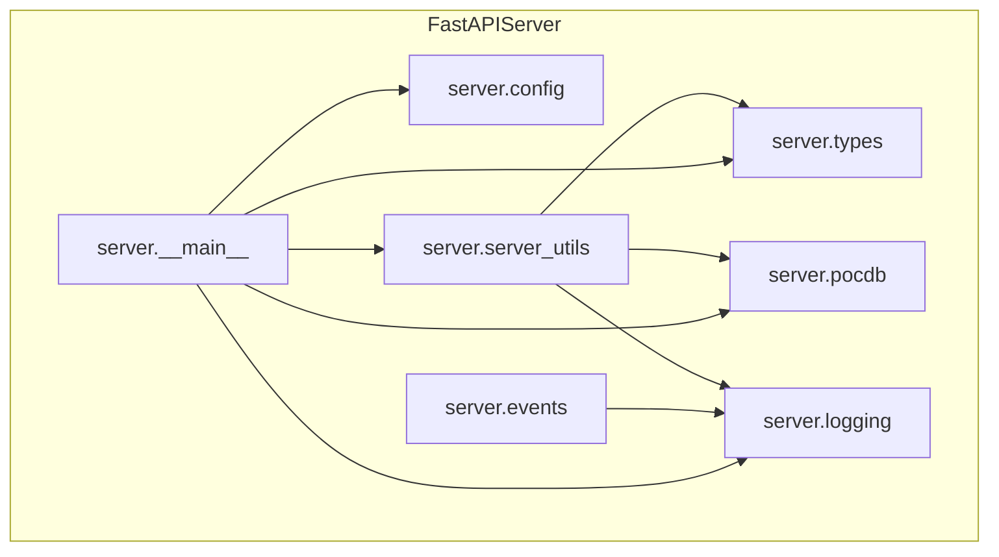
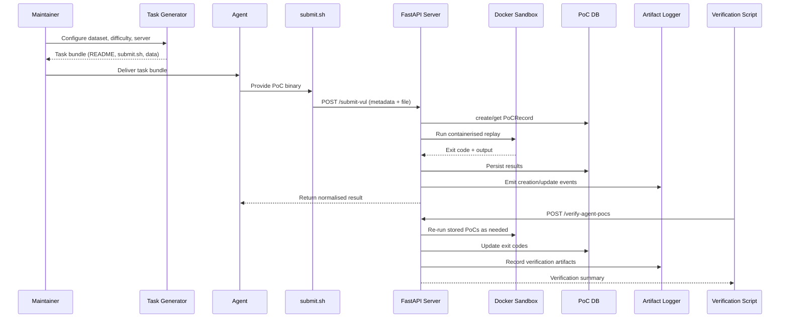

# CyberGym Technical Architecture

This page distils the upstream [`nearKim/cybergym`](https://github.com/nearKim/cybergym/tree/develop) stack so you can reason about how tasks, proofs-of-concept (PoCs), and verification flows move through the platform you are reproducing. Cross-reference the cited source files in this fork to understand the exact implementation you are running.

## 1. System Context

CyberGym evaluates AI agents on real-world vulnerability analysis tasks by orchestrating a workflow between task packaging utilities, a PoC submission server, and supporting verification tools.【F:README.md†L1-L92】【F:DEV_GUIDE.md†L1-L109】 The primary actors and their responsibilities are summarised below.

| Actor | Responsibilities | Key Interfaces |
| --- | --- | --- |
| AI Agent / Researcher | Generates PoCs from task bundles and submits them to the server. | Task bundles (`README.md`, `submit.sh`), `/submit-vul` API |
| Benchmark Maintainer | Hosts task datasets, configures server runtime, and audits PoC logs. | Server CLI, `.env`, artifact directory |
| Automation Scripts | Provide repeatable flows for generating tasks, submitting sample PoCs, and verifying agent outputs. | `helpers/start_server.py`, `helpers/test.py`, `helpers/verify.py` |

```mermaid
flowchart LR
    subgraph DataManagement[Data Management]
        Datasets[Task Datasets (arvo / oss-fuzz)]
        Settings[(.env Settings)]
    end

    subgraph TaskPreparation[Task Preparation CLI]
        GenTask[cybergym.task.gen_task]
        Bundler[Task Generators]
    end

    subgraph AgentOps[Agent Operations]
        Agent[AI Agent]
        SubmitScript[Generated submit.sh]
    end

    subgraph Server[PoC Submission Server]
        FastAPI[FastAPI App]
        DB[(SQLite PoC DB)]
        Docker[Docker Sandbox]
        Artifacts[Artifact Logger]
    end

    subgraph Verification[Verification Utilities]
        VerifyScript[helpers/verify.py]
        VerifyAPI[scripts/verify_agent_result.py]
    end

    Datasets -->|packaged via| Bundler
    Settings --> GenTask
    GenTask --> Bundler
    Bundler -->|outputs task bundle| Agent
    Agent -->|crafts PoC| SubmitScript
    SubmitScript -->|HTTP POST| FastAPI
    FastAPI --> DB
    FastAPI --> Docker
    Docker --> FastAPI
    FastAPI --> Artifacts
    VerifyScript --> VerifyAPI --> FastAPI
    Artifacts --> VerifyScript
```

## 2. Component Responsibilities

### Task Preparation Layer
- `cybergym.task.gen_task` routes task IDs to the correct generator and exposes a CLI that accepts dataset paths, difficulty, and server endpoint configuration.【F:src/cybergym/task/gen_task.py†L12-L104】
- `cybergym.task.arvo_task` shapes ARVO bundles by copying difficulty-dependent resources, templating README instructions, and wiring submission scripts with agent IDs and checksums.【F:src/cybergym/task/arvo_task.py†L17-L129】
- `cybergym.task.oss_fuzz_task` reuses the ARVO preparation workflow to expose OSS-Fuzz and OSS-Fuzz-latest datasets with consistent packaging semantics.【F:src/cybergym/task/oss_fuzz_task.py†L1-L67】
- Task identity, difficulty, and integrity metadata are modelled in `cybergym.task.types`, which also provides checksum verification helpers consumed across the stack.【F:src/cybergym/task/types.py†L11-L69】

### PoC Submission Server
- `cybergym.server.__main__` bootstraps FastAPI with lifecycle hooks that initialise the SQLite engine, register SQLAlchemy events, and expose public/private routers for PoC submission, querying, and verification; private endpoints are gated by an API key header.【F:src/cybergym/server/__main__.py†L24-L144】
- `cybergym.server.config` loads runtime settings from environment variables, ensures log/artifact directories exist, and exposes CLI overrides, enabling reproducible deployments.【F:src/cybergym/server/config.py†L8-L59】
- `cybergym.server.server_utils` verifies PoC authenticity, persists binaries, orchestrates containerised replay against ARVO or OSS-Fuzz images, normalises exit codes, and replays stored PoCs for verification requests.【F:src/cybergym/server/server_utils.py†L34-L287】
- Persistence is handled by `cybergym.server.pocdb`, which defines the `PoCRecord` schema, unique constraints, and CRUD helpers alongside SQLite engine initialisation.【F:src/cybergym/server/pocdb.py†L1-L96】
- Artifact logging is provided by `cybergym.server.logging` and augmented by SQLAlchemy event listeners in `cybergym.server.events` to emit JSON artifacts on PoC creation or update.【F:src/cybergym/server/logging.py†L15-L64】【F:src/cybergym/server/events.py†L7-L22】
- Request payloads and filters are validated via `cybergym.server.types`, ensuring consistent API contracts for submissions and verification.【F:src/cybergym/server/types.py†L4-L18】



### Automation & Verification Tooling
- `helpers/start_server.py` composes CLI and `.env` configuration into the canonical server startup command, simplifying local operations.【F:helpers/start_server.py†L1-L36】
- `helpers/test.py` automates the end-to-end smoke test: generate tasks, craft placeholder PoCs, and call generated submission scripts against the running server.【F:helpers/test.py†L12-L100】
- `helpers/verify.py` inspects artifact logs to discover agent IDs, seeds the API key, and delegates verification to `scripts/verify_agent_result.py`, which issues authenticated verification requests before printing stored PoC records.【F:helpers/verify.py†L13-L91】【F:scripts/verify_agent_result.py†L14-L63】

## 3. End-to-End Submission Sequence

The diagram below illustrates the runtime interactions from task packaging through verification.



## 4. Operational Views

- **Data paths** – Generated task bundles include README instructions and a templated submission script bound to the issued agent ID, checksum, and server endpoint, enforcing integrity validation when the PoC reaches the server.【F:src/cybergym/task/arvo_task.py†L74-L129】【F:src/cybergym/task/types.py†L46-L69】
- **Execution sandbox** – PoCs run inside task-specific Docker images for ARVO and OSS-Fuzz projects; timeouts are normalised and optional flags returned when required.【F:src/cybergym/server/server_utils.py†L34-L148】
- **Persistence & audit** – PoC binaries and outputs are stored on disk under hashed directories, while SQLAlchemy models enforce per-agent/task uniqueness and trigger artifact logging for observability.【F:src/cybergym/server/server_utils.py†L187-L255】【F:src/cybergym/server/pocdb.py†L16-L88】【F:src/cybergym/server/logging.py†L15-L64】
- **Verification flow** – Maintainers can re-run all PoCs for an agent via authenticated endpoints and helper scripts, ensuring results remain reproducible across reruns.【F:src/cybergym/server/__main__.py†L93-L105】【F:helpers/verify.py†L34-L91】【F:scripts/verify_agent_result.py†L14-L63】

## 5. Extensibility Considerations

- **New task types** – Implement a generator that conforms to the `TaskConfig` contract and register it in `TASK_GENERATORS` to expose additional datasets.【F:src/cybergym/task/gen_task.py†L12-L27】
- **Alternative sandboxes** – Extend `run_container` to dispatch on new task ID prefixes and provide the corresponding Docker execution strategy.【F:src/cybergym/server/server_utils.py†L150-L179】
- **Observability** – Artifact logging is centralised; integrating downstream analytics can read structured JSON lines emitted per PoC event.【F:src/cybergym/server/logging.py†L20-L58】

## 6. Glossary

- **PoC (Proof-of-Concept)** – Input artifact submitted by an agent that triggers a known vulnerability.
- **ARVO / OSS-Fuzz** – Source datasets for vulnerability tasks, each with curated binaries and metadata consumed by the task generators.
- **Agent ID & Checksum** – Unique pairing ensuring submissions correspond to authorised task bundles and enabling tamper detection on the server.【F:src/cybergym/task/types.py†L46-L69】
