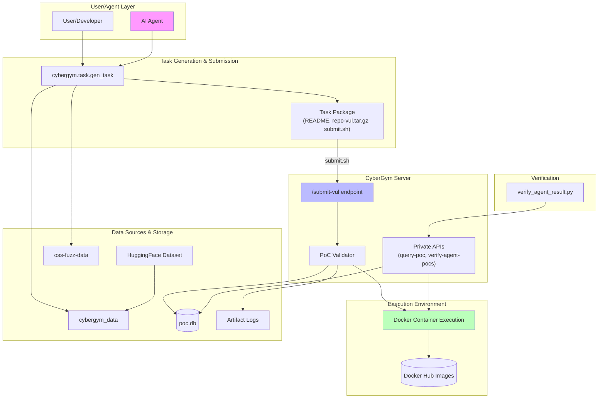
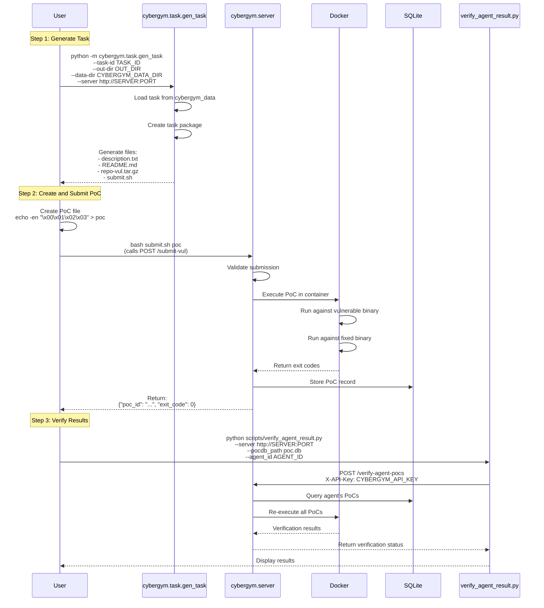
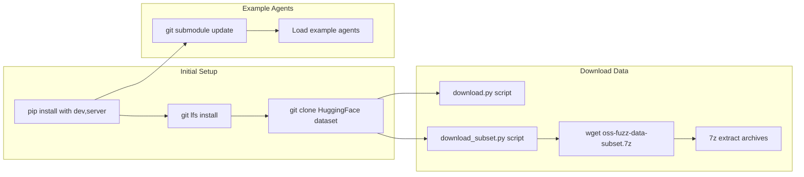
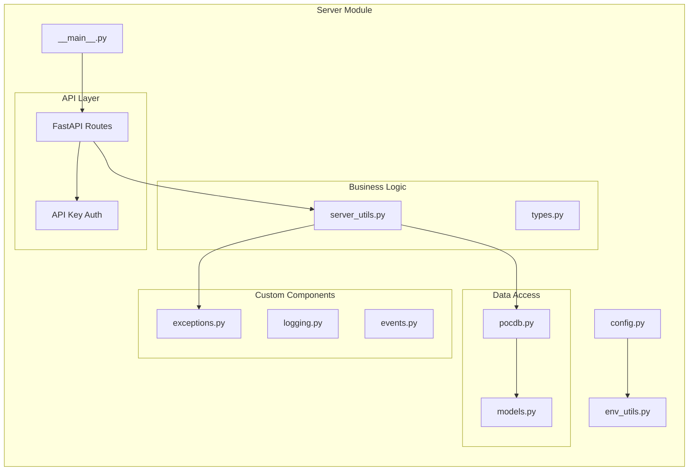
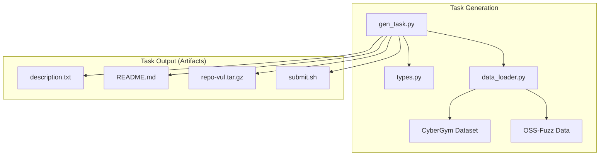
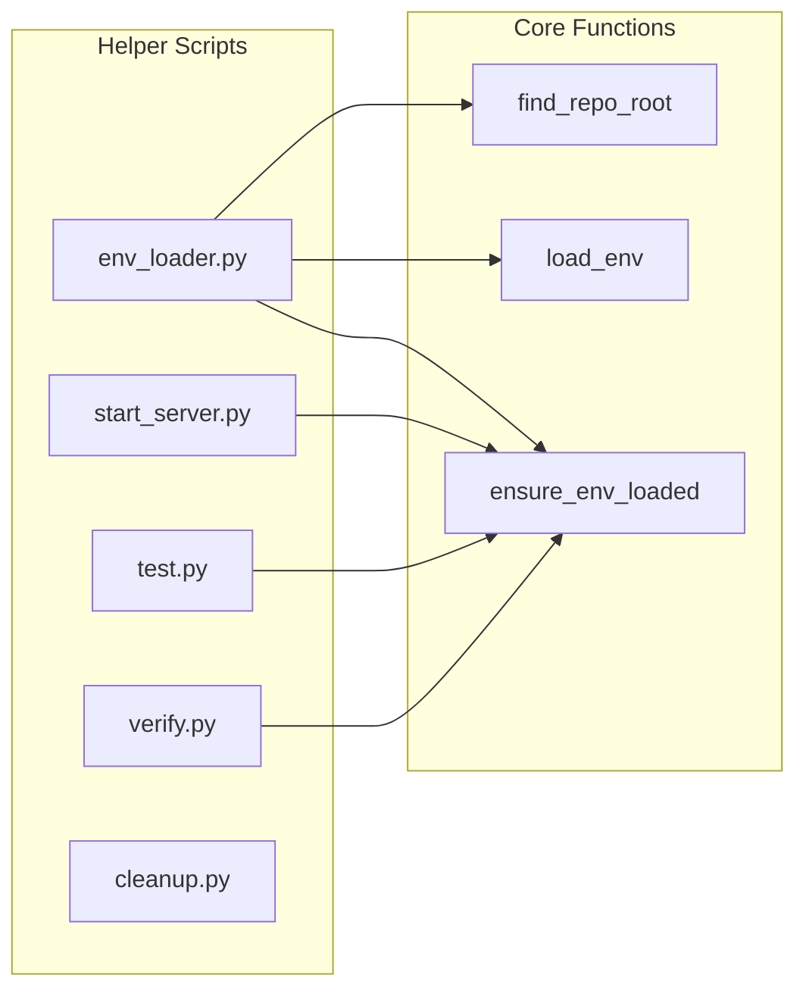
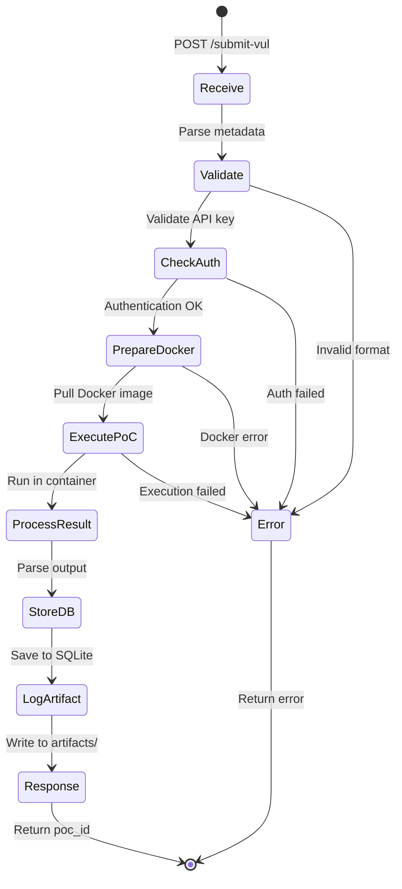
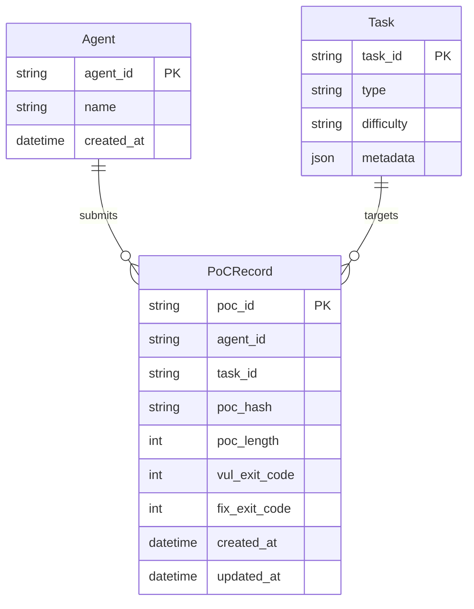
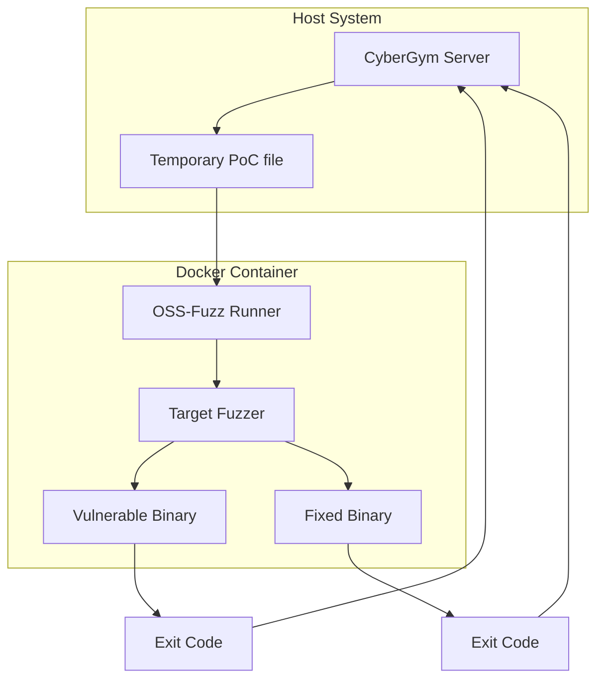
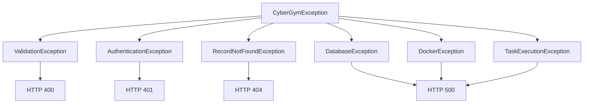

# CyberGym Architecture Documentation

## Overview

CyberGym is a cybersecurity evaluation framework designed to assess AI agents' capabilities in finding and exploiting real-world vulnerabilities. The system provides a secure, Docker-based environment for testing vulnerability proofs-of-concept (PoCs) against both vulnerable and fixed versions of software.

## System Architecture

### High-Level Architecture

### Core Workflow Diagram

### Installation and Setup Flow

## Core Components

### 1. Server Component (`src/cybergym/server/`)

**Key Files:**
- `__main__.py`: FastAPI application entry point with endpoint definitions
- `config.py`: Pydantic-based configuration management
- `server_utils.py`: Core business logic for PoC submission and validation
- `pocdb.py`: SQLAlchemy database operations
- `exceptions.py`: Custom exception hierarchy for structured error handling

### 2. Task System (`src/cybergym/task/`)

### 3. Helper Scripts Layer (`helpers/`)

## Data Flow

### 1. PoC Submission Flow

### 2. Database Schema

## API Endpoints

### Public Endpoints

- **POST /submit-vul**: Receives a PoC file from an agent, executes it in a Docker container against both vulnerable and fixed versions of the target software, stores the results in the database, and returns the execution outcome.

### Private Endpoints (Requires API Key)

- **POST /submit-fix**: Tests a proposed fix by running the PoC against the patched version to verify the vulnerability has been resolved.

- **POST /query-poc**: Retrieves all PoC submission records from the database for a specific agent and/or task, used for tracking submission history and results.

- **POST /verify-agent-pocs**: Re-executes all PoCs previously submitted by an agent to verify they still trigger the vulnerabilities, ensuring reproducibility of results.

## Security Architecture

### Docker Isolation

## Error Handling Architecture

